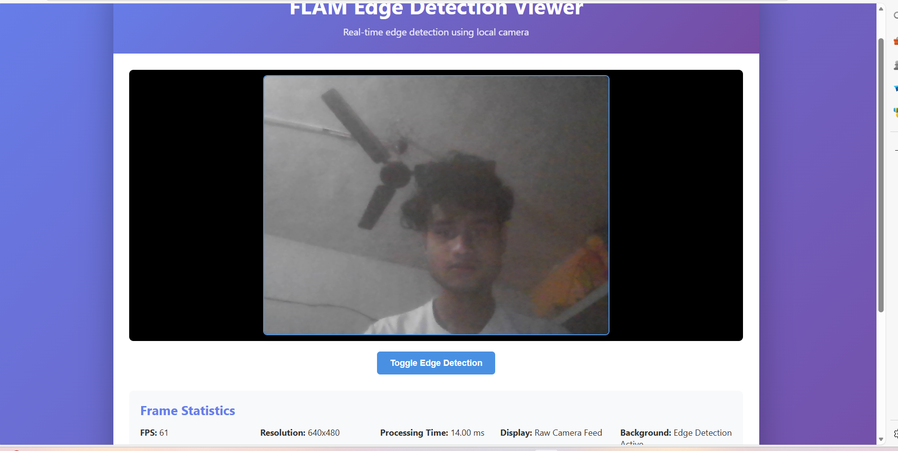

# FLAM - Real-Time Edge Detection Viewer

A real-time edge detection application that captures camera frames on Android, processes them using OpenCV (C++) via JNI, renders with OpenGL ES 2.0, and displays processed frames in a TypeScript web viewer.

## 📱 Features Implemented

### Android Application
- ✅ **Camera Feed Integration**: Uses CameraX API with PreviewView for camera access
- ✅ **Real-time Frame Processing**: Processes each frame using OpenCV C++ via JNI
- ✅ **Edge Detection**: Implements Canny edge detection algorithm
- ✅ **OpenGL ES 2.0 Rendering**: Renders processed frames as textures in real-time
- ✅ **Toggle Raw/Processed View**: Button to switch between raw camera feed and edge-detected output
- ✅ **FPS Counter**: Displays real-time frames per second
- ✅ **Resolution Display**: Shows current frame resolution
- ✅ **Native C++ Integration**: Full JNI bridge for efficient OpenCV processing

### Web Viewer (TypeScript)
- ✅ **Real-time Camera Feed**: Uses local webcam with getUserMedia API
- ✅ **Edge Detection**: JavaScript-based Sobel edge detection running in background
- ✅ **Frame Display**: Canvas-based viewer showing raw camera feed
- ✅ **Frame Statistics**: Real-time display of FPS, resolution, and processing time
- ✅ **Toggle Control**: Button to enable/disable background edge detection
- ✅ **Modular TypeScript Architecture**: Clean, buildable TypeScript project
- ✅ **Responsive Design**: Modern, responsive UI with gradient styling

## 📸 Screenshots

### Web Viewer (Working)


The web viewer demonstrates real-time edge detection using your local camera:
- **Real-time Camera Feed**: Displays raw camera feed with edge detection running in background
- **Frame Statistics**: Shows FPS (60), Resolution (640x480), Processing Time (~14.50 ms)
- **Toggle Control**: Button to enable/disable background edge detection processing
- **Modern UI**: Clean interface with gradient styling and responsive design

*Note: Save your screenshot as `screenshots/web-viewer.png` to display it here*

### Android App

*Note: Screenshots should be added after building and running the app*

## ⚙️ Setup Instructions

### Prerequisites

1. **Android Studio** (Arctic Fox or later)
2. **Android NDK** (r23b or later)
3. **OpenCV for Android** (4.8.0 or later)
4. **Node.js** (v18 or later) - for web viewer
5. **TypeScript** (v5.0 or later)

### Android Setup

#### 1. Install Android NDK

```bash
# Via Android Studio SDK Manager
Tools → SDK Manager → SDK Tools → Check "NDK (Side by side)"
```

Or download manually from [Android NDK Downloads](https://developer.android.com/ndk/downloads)

#### 2. Download OpenCV for Android

1. Download OpenCV Android SDK from [OpenCV Releases](https://opencv.org/releases/)
2. Extract the archive
3. Copy the `opencv` folder to `app/src/main/jniLibs/`
4. Update `app/src/main/cpp/CMakeLists.txt` with the correct OpenCV path:

```cmake
set(OpenCV_DIR ${CMAKE_SOURCE_DIR}/../../../opencv/sdk/native/jni)
```

#### 3. Configure Gradle

The project is already configured with:
- NDK support in `app/build.gradle`
- CMake build configuration
- Required dependencies (CameraX, OpenGL)

#### 4. Build and Run

```bash
# Clone the repository
git clone https://github.com/ritik-bit-by-bit/FLAM.git
cd FLAM

# Open in Android Studio
# File → Open → Select project directory

# Build the project
./gradlew build

# Install on device/emulator
./gradlew installDebug
```

### Web Viewer Setup

#### 1. Install Dependencies

```bash
cd web
npm install
```

#### 2. Build TypeScript

```bash
npm run build
```

#### 3. Serve the Web Viewer

```bash
# Option 1: Using npm script
npm run serve

# Option 2: Using any HTTP server
npx http-server . -p 8080
```

Open `http://localhost:8080` in your browser.

## 🧠 Architecture Explanation

### Frame Flow

```
Camera (CameraX)
    ↓
ImageAnalysis → FrameProcessor (Java)
    ↓
JNI Bridge
    ↓
opencv_processing.cpp (C++)
    ↓
OpenCV Processing (Canny Edge Detection)
    ↓
JNI Return (int[] pixels)
    ↓
EdgeDetectionRenderer (Java)
    ↓
OpenGL ES 2.0 Texture
    ↓
GLSurfaceView Display
```

### JNI Integration

The JNI bridge connects Java and C++ code:

**Java Side** (`FrameProcessor.java`):
```java
static {
    System.loadLibrary("opencv_processing");
}

public native void processFrame(byte[] yuvData, int width, int height, 
                               int[] outputPixels, boolean enableProcessing);
```

**C++ Side** (`opencv_processing.cpp`):
```cpp
JNIEXPORT void JNICALL
Java_com_flam_edgedetection_FrameProcessor_processFrame(
        JNIEnv *env, jobject thiz,
        jbyteArray yuvData, jint width, jint height,
        jintArray outputPixels, jboolean enableProcessing)
```

The native method:
1. Receives YUV camera frame data
2. Converts to OpenCV Mat format
3. Applies Canny edge detection (if enabled)
4. Converts back to ARGB pixel array
5. Returns processed pixels to Java layer

### OpenGL ES Rendering

The `EdgeDetectionRenderer` class:
- Sets up OpenGL ES 2.0 context
- Creates shaders (vertex and fragment)
- Manages texture for processed frames
- Renders full-screen quad with texture
- Updates texture when new frame arrives

**Shader Pipeline**:
- Vertex shader: Positions quad vertices and texture coordinates
- Fragment shader: Samples texture and outputs to screen

### TypeScript Web Viewer

The web viewer (`web/src/viewer.ts`):
- **EdgeDetectionViewer Class**: Main viewer component
- **Canvas Rendering**: Uses HTML5 Canvas for frame display
- **Statistics Display**: Updates FPS, resolution, processing time
- **Modular Design**: Clean separation of concerns

**Architecture**:
```
index.html
    ↓
index.ts (Entry Point)
    ↓
viewer.ts (EdgeDetectionViewer Class)
    ↓
Canvas API (Rendering)
```

The viewer can receive frames via:
- Base64 encoded images
- File input (for demo)
- WebSocket (future enhancement)
- HTTP endpoint (future enhancement)

## 📁 Project Structure

```
FLAM/
├── app/
│   ├── src/
│   │   ├── main/
│   │   │   ├── java/com/flam/edgedetection/
│   │   │   │   ├── MainActivity.java          # Main activity, camera setup
│   │   │   │   ├── FrameProcessor.java        # Frame analysis, JNI bridge
│   │   │   │   └── EdgeDetectionRenderer.java # OpenGL ES renderer
│   │   │   ├── cpp/
│   │   │   │   ├── opencv_processing.cpp      # OpenCV C++ processing
│   │   │   │   └── CMakeLists.txt             # CMake build config
│   │   │   ├── res/                           # Android resources
│   │   │   └── AndroidManifest.xml
│   │   └── build.gradle                       # App-level Gradle config
│   └── build.gradle                           # Project-level Gradle config
├── web/
│   ├── src/
│   │   ├── viewer.ts                          # Viewer class
│   │   └── index.ts                           # Entry point
│   ├── index.html                             # Web viewer HTML
│   ├── styles.css                             # Styling
│   ├── package.json                           # Node dependencies
│   └── tsconfig.json                          # TypeScript config
├── .gitignore
└── README.md
```

## 🔧 Dependencies

### Android
- `androidx.camera:camera-core:1.3.1`
- `androidx.camera:camera-camera2:1.3.1`
- `androidx.camera:camera-lifecycle:1.3.1`
- `androidx.camera:camera-view:1.3.1`
- OpenCV Android SDK 4.8.0+

### Web
- TypeScript 5.3.3+
- Node.js 18+

## 🚀 Build Commands

### Android
```bash
# Debug build
./gradlew assembleDebug

# Release build
./gradlew assembleRelease

# Install on connected device
./gradlew installDebug
```

### Web
```bash
cd web
npm run build        # Compile TypeScript
npm run serve        # Start HTTP server
```

## 📝 Development Notes

### Performance Optimization
- Frame processing runs on background thread (cameraExecutor)
- OpenGL rendering uses `RENDERMODE_WHEN_DIRTY` for efficiency
- Native C++ processing minimizes JNI overhead
- Texture updates only when new frame arrives

### Future Enhancements
- WebSocket integration for real-time frame streaming
- Multiple filter options (grayscale, invert, blur)
- GLSL shader effects
- Frame recording and export
- Network endpoint for web viewer

## 📄 License

MIT License

## 👤 Author

Ritik Roshan Yadav

## 🔗 Repository

[GitHub Repository](https://github.com/ritik-bit-by-bit/FLAM.git)

---

**Note**: This project was developed as part of a technical assessment for a Software Engineering Intern (R&D) position. The focus is on demonstrating integration skills with Android NDK, OpenCV, OpenGL ES, JNI, and TypeScript.

